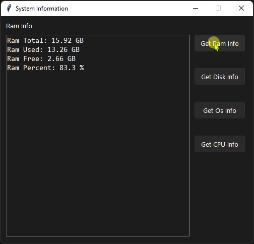
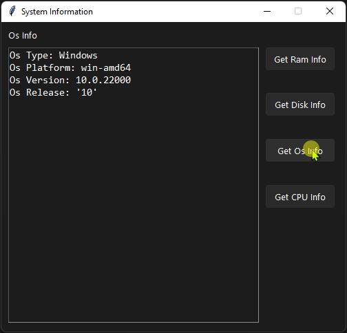
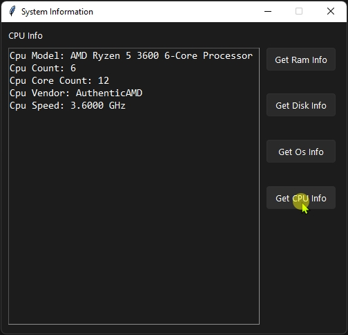

# SystemConfig

A tkinter based system data viewer tool.

Technologies:
- tkiner
- python

Third-party:
- psutil 
- cpuinfo

Theme and style:
- ttk
- [rdbende/Sun-Valley-ttk-theme](https://github.com/rdbende/Sun-Valley-ttk-theme)

## Screenshots
- __RAM Info__  
  
- __OS Info__  
  
- __CPU Info__  
  